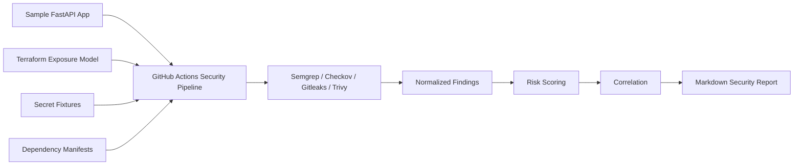

# Cloud AppSec Risk Analyzer

Cloud AppSec Risk Analyzer is a DevSecOps portfolio project that demonstrates how application security findings, cloud exposure signals, and CI/CD security automation can be combined into a prioritized risk report.

The project is built around a small vulnerable FastAPI application, intentionally risky Terraform configuration, multiple security scanners, and a Python analyzer that normalizes, scores, correlates, and reports findings.

## What It Does

The pipeline answers a practical AppSec question:

> Which security findings matter most, and why?

It does this by collecting scanner outputs from multiple security domains and turning them into a single risk-focused report.

Current flow:

```text
Security scanners
  -> normalized findings
  -> merged findings
  -> risk scoring
  -> correlated risk scenarios
  -> Markdown security report
```

## Security Coverage

| Domain | Tool | Purpose |
| --- | --- | --- |
| SAST | Semgrep | Detects insecure application code patterns. |
| IaC scanning | Checkov | Detects risky Terraform/cloud configuration. |
| Secret scanning | Gitleaks | Detects committed secret-like material. |
| Dependency scanning | Trivy | Scans dependency manifests for known vulnerabilities. |

## Architecture



## Repository Structure

```text
app/                 Sample FastAPI application used as the scan target
analyzer/            Normalization, scoring, correlation, and reporting code
docs/                Design notes and technical documentation
infra/terraform/     Intentionally risky Terraform exposure model
pipeline/            Local helper scripts
semgrep-rules/       Local Semgrep rules
test-fixtures/       Controlled fixtures for scanner validation
.github/workflows/   GitHub Actions security pipeline
Dockerfile           Container definition for the sample API
requirements.txt     Python dependencies for the sample app and analyzer
```

Generated scanner outputs and reports are intentionally not committed:

```text
scanner-results/
reports/
```

They are produced by GitHub Actions and uploaded as workflow artifacts.

## Analyzer Stages

The analyzer currently supports:

- normalization of Semgrep, Checkov, Gitleaks, and Trivy JSON output;
- merging findings into a shared schema;
- risk scoring based on severity, impact, likelihood, confidence, and context;
- rule-based correlation into risk scenarios;
- Markdown report generation.

Current correlated risk scenarios:

- `public_app_exposure`
- `privileged_access_risk`
- `cloud_data_exposure`

## CI Output

The GitHub Actions workflow produces a `security-scan-artifacts` artifact containing:

```text
scanner-results/semgrep.json
scanner-results/checkov.json
scanner-results/gitleaks.json
scanner-results/trivy.json
scanner-results/*-normalized-findings.json
scanner-results/normalized-findings.json
scanner-results/scored-findings.json
scanner-results/correlated-risks.json
reports/security-report.md
```

## Intentional Test Data

This repository contains intentionally vulnerable or risky examples so the pipeline has stable findings to analyze.

Examples include:

- unsafe SQL string construction in the sample API;
- public and over-permissive Terraform patterns;
- a controlled fake secret fixture;
- scanner-specific fixtures and rules.

These examples are documented and should not be deployed as production code.

## Documentation

- [Project brief](docs/project-brief.md)
- [Design decisions](docs/design-decisions.md)
- [API testing notes](docs/api-testing.md)
- [Security scanning](docs/security-scanning.md)
- [Finding normalization](docs/finding-normalization.md)
- [Risk scoring](docs/risk-scoring.md)
- [Correlation](docs/correlation.md)
- [Reporting](docs/reporting.md)
- [IaC exposure model](docs/iac-exposure-model.md)
- [Secret scanning](docs/secret-scanning.md)
- [Dependency scanning](docs/dependency-scanning.md)

## Current Status

The core MVP is implemented:

- sample application and scan targets;
- multi-scanner GitHub Actions pipeline;
- normalized finding model;
- risk scoring;
- correlated risk scenarios;
- Markdown report artifact.

Future enhancements may include container image scanning, SARIF upload, OpenSSF Scorecard, policy-as-code gates, and an HTML dashboard.
