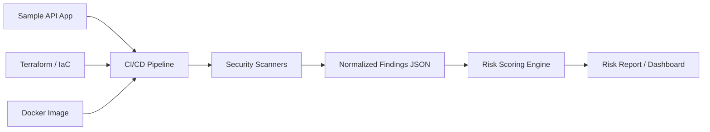

# Cloud AppSec Risk Analyzer

Cloud AppSec Risk Analyzer is a portfolio DevSecOps project that demonstrates how application security, cloud exposure analysis, and CI/CD security automation can be combined to prioritize real-world risks across code, dependencies, containers, secrets, and infrastructure-as-code.

## Purpose

Modern security teams receive findings from many tools: SAST scanners, secret scanners, container scanners, dependency scanners, and IaC scanners. Each tool reports useful data, but the findings are often disconnected from business and cloud exposure context.

This project shows how those signals can be normalized, correlated, and converted into a risk-focused report that helps answer a practical question:

> Which security findings matter most, and why?

## MVP Scope

The first version of this project will include:

- A sample API application with intentionally vulnerable patterns.
- A Docker image for the sample application.
- Terraform configuration with intentionally risky cloud-style settings.
- A CI/CD security pipeline.
- Security scans using Semgrep, Gitleaks, Trivy, and Checkov.
- A parser that normalizes scanner output into a single JSON format.
- A simple risk scoring engine.
- A generated Markdown or HTML risk report.
- Documentation mapping the project to AppSec and DevSecOps practices.

## Planned Architecture



## Security Domains Covered

- SAST: insecure code patterns and application-level weaknesses.
- SCA: vulnerable third-party dependencies.
- Secret scanning: exposed credentials and sensitive values.
- Container scanning: vulnerable packages inside images.
- IaC scanning: risky infrastructure-as-code configuration.
- Risk correlation: combining technical findings with exposure context.

## Repository Status

This repository is in the early MVP stage. The project brief and sample API application have been started.

## Current Components

```text
app/                Sample FastAPI application used as the scan target
analyzer/           Scanner normalization, risk scoring, and report generation
docs/               Project brief and supporting documentation
infra/terraform/    Intentionally risky Terraform exposure model
pipeline/           Local pipeline helper scripts
Dockerfile          Container definition for the sample API
requirements.txt    Python dependencies
```

Useful documentation:

- [Project brief](docs/project-brief.md)
- [Design decisions](docs/design-decisions.md)
- [API testing notes](docs/api-testing.md)
- [Security scanning](docs/security-scanning.md)
- [Finding normalization](docs/finding-normalization.md)
- [Risk scoring](docs/risk-scoring.md)
- [Reporting](docs/reporting.md)
- [IaC exposure model](docs/iac-exposure-model.md)
- [Secret scanning](docs/secret-scanning.md)
